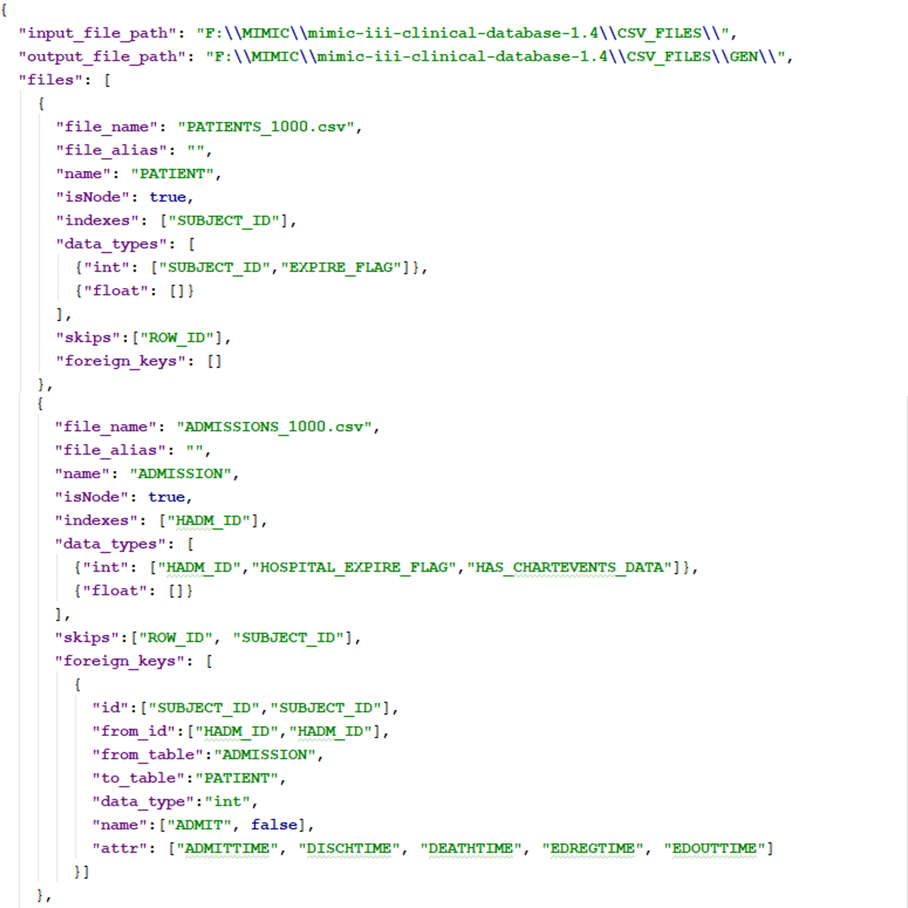

# Relational to Neo4j Graph Database Conversion (Rel2Neo) #

A Python library to convert a relational database to a Neo4j graph database. 

### Input ###

1. The current version of the Rel2Neo supports CSV files. 
Therefore, it allows containing each table in the relational database as a CSV file.
2. A config file in JSON format that includes all the details of the data conversion. (e.g., [config_mimic.json](config/config_mimic.json))
 
### Output ###
1. CSV files representing nodes and edges in Neo4j.
2. Neo4j insert queries for generated files in order. (e.g., [neo4j_insert_queries_mimic.txt](neo4j_query/neo4j_insert_queries_mimic.txt))

### Example config file ###
It fully describes the nodes, relationships, their attributes, and directions.
The user has the complete flexibility to define the Neo4j graph model.

### License
This program is free software: you can redistribute it and/or modify it under the terms of the GNU General Public License as published by the Free Software Foundation, version 3 of the License (GNU GPLv3).

### Contact Us
We are Computer Networking Research Lab (CNRL), Department of Electrical & Computer Engineering, Colorado State University, USA.\
[shashika@colostate.edu](mailto:shashika@colostate.edu)\
[anura@colostate.edu](mailto:anura@colostate.edu) 